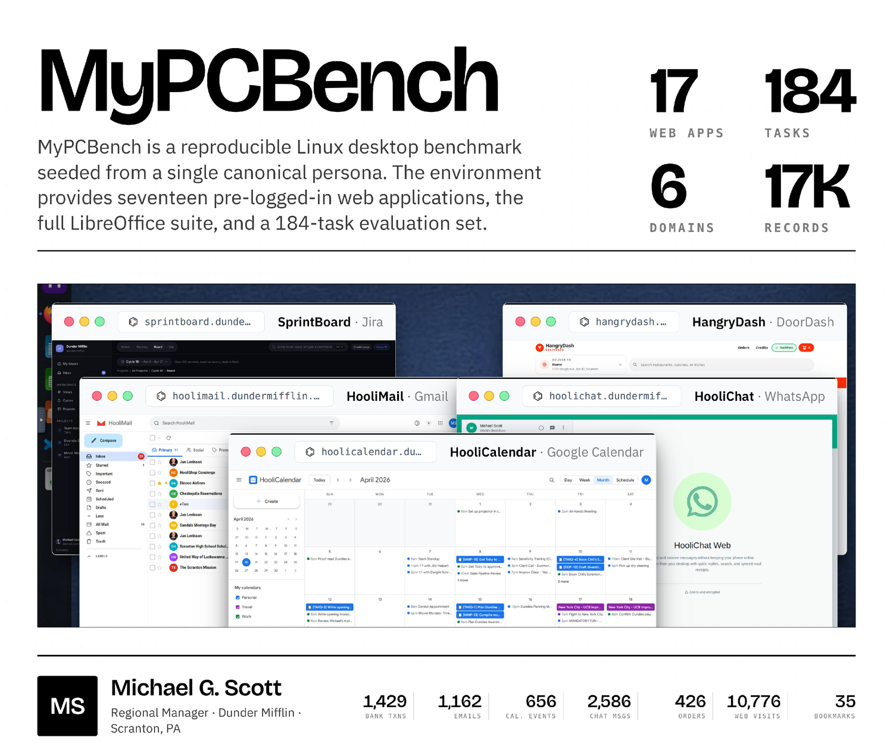

# MyPCBench

**A benchmark for personally intelligent computer-use agents.**



> A reproducible Linux-desktop benchmark seeded end-to-end from one canonical
> persona (Michael Scott, *The Office*). The image hosts 17 pre-logged-in web
> apps mirroring real consumer products plus the full LibreOffice suite; the
> persona's records (1,429 bank txns · 1,162 emails · 656 calendar events ·
> 2,586 chats · 426 retail/food orders · 10,776 web visits · 35 bookmarks)
> are **cross-linked**, so one trip leaves correlated records across every app
> that would plausibly book it.

## Why

Computer-use benchmarks evaluate agents in **impersonal** environments — empty
desktops, generic app state, minimally-seeded DBs — and web evals skip any
site behind a login. But a personal assistant has to work across a user's
*whole digital life*. MyPCBench closes that gap: a deterministic generator
populates a coherent user identity at the scale of a real personal computer,
so standard desktop-agent loops can be evaluated on tasks that
require **knowing who the user is** ("order my usual Friday DoorDash", "what
do I normally tip?", "pay Jim back what I owe him").

## At a glance

- **17 web apps** (banking, travel, food delivery, calendar, messaging, work, tax, …) + Firefox + LibreOffice on a real QEMU/KVM Ubuntu 24.04 + GNOME VM
- **184 tasks**, each adapted from a real OpenClaw personal-assistant request and author-audited end-to-end, with a natural-language **rubric**
- **6 behavioural task types** — 4 analysis (personal lookup, aggregation & reporting, pattern inference, cross-source reconciliation) + 2 action (bounded, orchestrated); 72 analysis / 112 action; **68 % multi-app**
- **1 canonical persona**, cross-consistent across every app; deterministic snapshot reset (OSWorld-style)
- **Decoupled grading**: the runner records completion; an offline LLM-as-judge scores per rubric
- **Runs with or without Docker** — boots directly under QEMU/KVM (no daemon, no root)

## Results

These paper numbers were measured on the archived `eval-round0` / v0.0
baseline. Fresh benchmark runs default to the current `latest` image so tasks
track the daily rebuilt environment. Six closed- and open-weight models under
each provider's native CUA agent (Claude uses computer + bash + editor; OpenAI
uses computer + built-in shell; Qwen main uses computer + bash — see Agents).
**Perfect** = % of tasks where every rubric passes; **Rubric** = mean rubric
pass-rate (partial credit).

| Model | Perfect % | Rubric % |
|---|--:|--:|
| Claude Opus 4.6 | **55.4** | **81.8** |
| Claude Sonnet 4.6 | 39.1 | 65.4 |
| GPT-5.5 | 29.3 | 54.1 |
| GPT-5.4 mini | 19.0 | 48.8 |
| Qwen 3.5 35B-A3B | 7.6 | 42.5 |
| Qwen 3.5 9B | 2.7 | 7.0 |

Claude Opus 4.6 is the only model above 50 % perfect — and even it solves
only ~36 % of tasks that span 7+ apps; Sonnet drops to 14 %, GPT-5.5 to
4.5 %, and GPT-5.4 mini and both Qwen models to 0 % on that slice. Failures
cluster on long, multi-app trajectories — exactly where personalization
stresses an assistant most.

## Quick start

```bash
git clone https://github.com/ljang0/MyPCBench && cd MyPCBench
python3 -m venv .venv && source .venv/bin/activate   # Python ≥ 3.9; Ubuntu 24.04 is PEP-668
pip install -r requirements.txt
cp .env.example .env     # add ANTHROPIC_API_KEY / OPENAI_API_KEY / GEMINI_API_KEY
```

**No Docker** (recommended; works on GPU/compute nodes — no daemon, no root).
When `skopeo` is available, `get-eval-image.sh` fetches the Docker image and
extracts the bundled qcow2 + OVMF. Without `skopeo`, it falls back to the
matching HuggingFace qcow2; install `ovmf` separately or set
`MYPCBENCH_OVMF_CODE` if your distro does not ship it in a standard location.
`run_mypcbench.py --backend qemu` auto-fetches `latest` into `./mypcbench-vm`
when no `--qcow2_path` or `MYPCBENCH_QCOW2` is supplied. To prefetch manually:

```bash
bash scripts/get-eval-image.sh --out ./mypcbench-vm   # defaults to --set latest
set -a; source .env; set +a           # API keys
source ./mypcbench-vm/env.sh          # exports MYPCBENCH_QCOW2 / MYPCBENCH_OVMF_*

# sanity: one task, no API cost — confirms the VM boots + Control API works
python3 agent-harness/run_mypcbench.py --backend qemu \
  --qcow2_path "$MYPCBENCH_QCOW2" --agent_type dummy --model dummy \
  --tasks_dir tasks/smoke_one --max_steps 4 --result_dir results/smoke

python3 agent-harness/run_mypcbench.py --backend qemu \
  --qcow2_path "$MYPCBENCH_QCOW2" \
  --agent_type claude_cuabash --model claude-opus-4-6 \
  --tasks_dir tasks/final --max_steps 100 --result_dir results/opus

python3 agent-harness/judge_results.py --result_dir results/opus   # offline grade
```

A single smoke task is ≈1–3 min plus a one-time ~90 s VM boot; the full
`tasks/final` set (184 tasks) is a long, API-cost-heavy run — start with
`tasks/smoke_one`.

**Docker** alternative (QEMU-in-Docker wrapper): see
**[docs/QEMU_QUICKSTART.md](docs/QEMU_QUICKSTART.md)**, or
`bash scripts/run-agent.sh --parallel 1 --agent claude_cuabash --model claude-opus-4-6`
(spins its own container).

Full guide (two image sets, every agent, local-vLLM Qwen, troubleshooting):
**[docs/NO_DOCKER.md](docs/NO_DOCKER.md)**.

### Smoke-Tested Setup Paths

Use `dummy` first on a new host; it costs no API calls and verifies boot,
Control API, app ports, and result writing.

```bash
# Docker wrapper, current image. Runner-owned starts pull latest before boot.
python3 agent-harness/run_mypcbench.py --backend docker \
  --agent_type dummy --model dummy \
  --tasks_dir tasks/smoke_one --max_steps 4 --result_dir results/smoke-docker

# QEMU-direct, current image. Auto-fetches ./mypcbench-vm if no qcow2 is set.
python3 agent-harness/run_mypcbench.py --backend qemu \
  --agent_type dummy --model dummy \
  --tasks_dir tasks/smoke_one --max_steps 4 --result_dir results/smoke-qemu

# Explicit qcow2 path, for pinned/local image testing.
bash scripts/get-eval-image.sh --out ./mypcbench-vm
python3 agent-harness/run_mypcbench.py --backend qemu \
  --qcow2_path ./mypcbench-vm/mypcbench.qcow2 \
  --agent_type dummy --model dummy \
  --tasks_dir tasks/smoke_one --max_steps 4 --result_dir results/smoke-qcow2

# Parallel wrapper smoke, one VM. Use --backend qemu or --backend docker.
python3 agent-harness/run_parallel_tasks.py --backend qemu \
  --tasks-file tasks/smoke_one/one.json --num-vms 1 \
  --agent-type dummy --model dummy --max-steps 4 \
  --result-dir results/smoke-parallel-qemu
```

## Image sets

Two pre-baked images (both Michael Scott, instant boot). By default the runner
uses the current daily/OSS-polish image so tasks track the freshest published
benchmark VM. Fetch either with **no docker/root** via
`scripts/get-eval-image.sh --set <latest|eval-round0>`.

The canonical no-Docker artifact is the **qcow2** on HuggingFace. The Docker
`-qemu` image bundles a qcow2 and runs it via `qemu-system-x86_64`.

| Set | Use | Docker Hub `ljang/mypcbench-qemu` | HF `ljang0/mypcbench-qemu-baseline` |
|---|---|---|---|
| **`latest`** | **default current benchmark VM** — daily/OSS-polish build used for fresh tasks and release checks | `:latest` (≡ `:v1.2.47-oss-polish`, `:demo`, `:michael_scott`, `:michael_scott-2026-06-06`) · image `sha256:2050585961cd…` | `michael_scott.qcow2` · qcow2 `sha256:c970a526e1ce21…` |
| **`eval-round0`** | **archived v0.0 paper baseline** (`v1.2.15-round78e`) — use only to reproduce the paper numbers above | `:eval-round0` (≡ `:eval-round0-michael_scott`) · image `sha256:86d4da6575eb…` | `michael_scott_round78e.qcow2` · qcow2 `sha256:c7209624dfae24…` |

Docker-backed runner-owned starts use `docker run --pull always`, so mutable
tags such as `latest` are refreshed before the VM starts. If you manually reuse
a pre-booted container, recreate it yourself to pick up a new daily image.
Direct-QEMU starts auto-fetch `latest` only when no local qcow2 is supplied; if
you point `--qcow2_path` or `MYPCBENCH_QCOW2` at a file, that explicit file is
used as-is.

Requirements: Linux + KVM (`/dev/kvm`) + QEMU, ~16 GB RAM per VM. Docker optional.

## Agents

Each agent uses its family's native tool-calling. `cuabash` = computer + bash, `cua` = computer only.

| `--agent_type` | Model | Tools | Paper role |
|---|---|---|---|
| `claude_cuabash` | `claude-opus-4-6` / `claude-sonnet-4-6` | computer + bash + editor | Claude main |
| `openai_cuabash` | `gpt-5.5` / `gpt-5.4-mini` | computer + OpenAI built-in shell | GPT main |
| `qwen_cuabash` | `Qwen/Qwen3.5-35B-A3B` / `-9B` | computer + bash (OSWorld-parity) | Qwen main |
| `qwen_cua` | same | computer only | Qwen appendix ablation |
| `dummy` | — | none | smoke / CI (no API cost) |

The runner injects `OPENAI_API_KEY` into the VM's chat apps so NPC personas
reply in-character (many tasks depend on it); without a key those apps still
work but auto-replies are disabled.

## Grading (decoupled, two-step)

1. **Run** — `run_mypcbench.py` writes `result.txt` (1.0 ran to completion / 0.0 errored) + `rubric_bundle.json` per task. It does *not* grade.
2. **Judge** — `python3 agent-harness/judge_results.py --result_dir <dir>` scores each bundle offline (no live VM) → `rubric_judge_result.json` per task + aggregate `scores.json`; idempotent (`--force` re-judges).

Each task has 3–13 equally-weighted rubric criteria (mean 6.5; 1,191 total). Default judge:
full-trajectory per-rubric on Gemini `gemini-3.1-flash-lite-preview` (the
paper config); override via `MYPCBENCH_RUBRIC_JUDGE_MODEL`.

## This repository

This repository is the **evaluation harness only**: `agent-harness/`,
`tasks/final/` = 184 tasks, `personas/michael_scott.json`, `scripts/`,
`docs/`. The VM is a separate pre-baked downloadable image. The environment
**build source** (17-app monorepo, generator, QEMU bake) is not part of
this public release. Docs: [NO_DOCKER.md](docs/NO_DOCKER.md) ·
[QEMU_QUICKSTART.md](docs/QEMU_QUICKSTART.md).

## Citation & license

MIT License — see [LICENSE](LICENSE). The agent harness builds on
**OSWorld** (Apache-2.0, see [NOTICE](NOTICE)); the full-trajectory rubric
judge is ported from **[Odysseys](https://github.com/ljang0/Odysseys)**
(`scripts/python/run_full_trajectory_per_rubric.py`, CC-BY-4.0).
